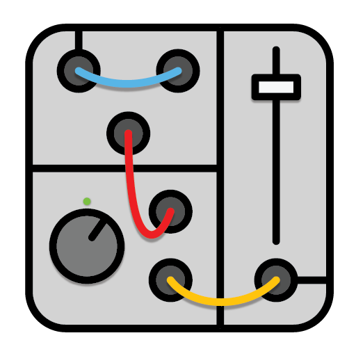

<div id="top"></div>

<!-- PROJECT LOGO -->
<br />
<div align="center">
  <a href="https://github.com/K3LS0/web-synth">
    
  </a>

<h3 align="center">Modular Web Synthesiser</h3>

  <p align="center">
    A Modular Synthesiser Project for MU379A
  </p>
</div>


<!-- TABLE OF CONTENTS -->
<details>
  <summary>Table of Contents</summary>
  <ol>
    <li>
      <a href="#about-the-project">About The Project</a>
      <ul>
        <li><a href="#built-with">Built With</a></li>
      </ul>
    </li>
    <!-- <li>
      <a href="#getting-started">Getting Started</a>
      <ul>
        <li><a href="#prerequisites">Prerequisites</a></li>
        <li><a href="#installation">Installation</a></li>
      </ul>
    </li>
    <li><a href="#usage">Usage</a></li>
    <li><a href="#roadmap">Roadmap</a></li>
    <li><a href="#contributing">Contributing</a></li>
    <li><a href="#license">License</a></li> -->
    <li><a href="#contact">Contact</a></li>
    <li><a href="#acknowledgments">Acknowledgments</a></li>
  </ol>
</details>


<!-- ABOUT THE PROJECT -->
## About The Project

<!-- [![Product Name Screen Shot][product-screenshot]](https://example.com) -->

The goal of this project is to allow users to learn the fundamentals of modular synthesis in a casual and accessible manner. The application should be accessible in any modern browser, allowing users to expirent and explore the possibilities of modular synthesis.

This project is my submission for my final year project at Maynooth University, under the supervision of Prof. Victor Lazzarini.

<p align="right">(<a href="#top">back to top</a>)</p>


### Built With

* [WebAudioAPI](https://developer.mozilla.org/en-US/docs/Web/API/Web_Audio_API)

<p align="right">(<a href="#top">back to top</a>)</p>


<!-- GETTING STARTED -->
<!-- ## Getting Started

This is an example of how you may give instructions on setting up your project locally.
To get a local copy up and running follow these simple example steps.

### Prerequisites

This is an example of how to list things you need to use the software and how to install them.
* npm
  ```sh
  npm install npm@latest -g
  ```

### Installation

1. Get a free API Key at [https://example.com](https://example.com)
2. Clone the repo
   ```sh
   git clone https://github.com/K3LS0/web-synth.git
   ```
3. Install NPM packages
   ```sh
   npm install
   ```
4. Enter your API in `config.js`
   ```js
   const API_KEY = 'ENTER YOUR API';
   ```

<p align="right">(<a href="#top">back to top</a>)</p> -->


<!-- USAGE EXAMPLES -->
<!-- ## Usage

Use this space to show useful examples of how a project can be used. Additional screenshots, code examples and demos work well in this space. You may also link to more resources.

_For more examples, please refer to the [Documentation](https://example.com)_

<p align="right">(<a href="#top">back to top</a>)</p> -->


<!-- ROADMAP -->
<!-- ## Roadmap

- [ ] Feature 1
- [ ] Feature 2
- [ ] Feature 3
    - [ ] Nested Feature

See the [open issues](https://github.com/K3LS0/web-synth/issues) for a full list of proposed features (and known issues).

<p align="right">(<a href="#top">back to top</a>)</p> -->


<!-- LICENSE -->
<!-- ## License

Distributed under the MIT License. See `LICENSE.txt` for more information.

<p align="right">(<a href="#top">back to top</a>)</p> -->


<!-- CONTACT -->
## Contact

Adam Kelso - adam.kelso.2019@mumail.ie

Project Link: [https://github.com/K3LS0/web-synth](https://github.com/K3LS0/web-synth)

<p align="right">(<a href="#top">back to top</a>)</p>


<!-- ACKNOWLEDGMENTS -->
## Acknowledgments

* [Maynooth University Music Technology Department](https://www.maynoothuniversity.ie/study-maynooth/find-course/music-technology)
* [Prof. Victor Lazzarini](https://www.maynoothuniversity.ie/people/victor-lazzarini)

<p align="right">(<a href="#top">back to top</a>)</p>


<!-- MARKDOWN LINKS & IMAGES -->
<!-- https://www.markdownguide.org/basic-syntax/#reference-style-links -->
[contributors-shield]: https://img.shields.io/github/contributors/K3LS0/web-synth.svg?style=for-the-badge
[contributors-url]: https://github.com/K3LS0/web-synth/graphs/contributors
[forks-shield]: https://img.shields.io/github/forks/K3LS0/web-synth.svg?style=for-the-badge
[forks-url]: https://github.com/K3LS0/web-synth/network/members
[stars-shield]: https://img.shields.io/github/stars/K3LS0/web-synth.svg?style=for-the-badge
[stars-url]: https://github.com/K3LS0/web-synth/stargazers
[issues-shield]: https://img.shields.io/github/issues/K3LS0/web-synth.svg?style=for-the-badge
[issues-url]: https://github.com/K3LS0/web-synth/issues
[license-shield]: https://img.shields.io/github/license/K3LS0/web-synth.svg?style=for-the-badge
[license-url]: https://github.com/K3LS0/web-synth/blob/master/LICENSE.txt
[linkedin-shield]: https://img.shields.io/badge/-LinkedIn-black.svg?style=for-the-badge&logo=linkedin&colorB=555
[linkedin-url]: https://linkedin.com/in/linkedin_username
[product-screenshot]: images/screenshot.png
